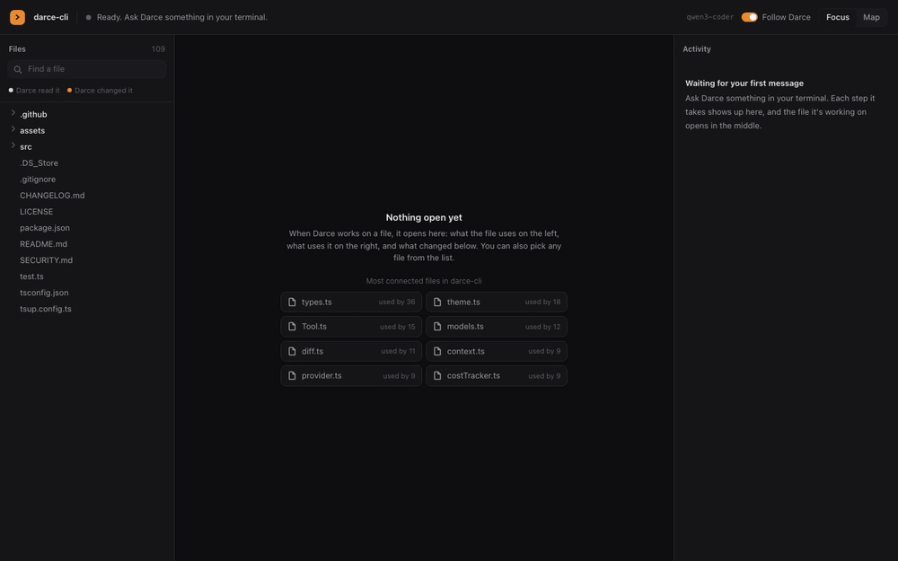
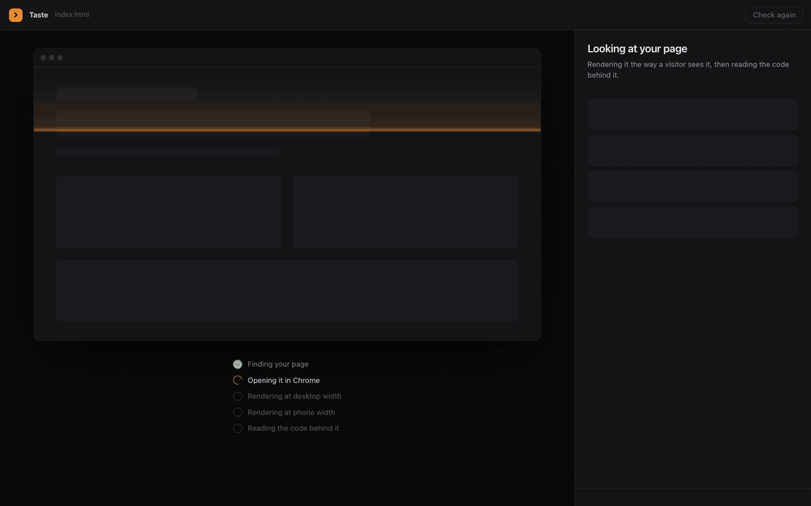

<p align="center">
  <a href="https://darce.dev"></a>
</p>

<h1 align="center">Darce</h1>

<p align="center">
  <strong>The coding agent you can undo.</strong><br>
  An open-source AI agent for your terminal. It writes code and runs commands with 250+ models,<br>
  and <code>/undo</code> rolls back everything it did, even files <code>rm</code>, <code>mv</code> and <code>npm install</code> changed.
</p>

<p align="center">
  <a href="https://www.npmjs.com/package/darce-cli"></a>
  <a href="https://www.npmjs.com/package/darce-cli"></a>
  <a href="https://github.com/AmerSarhan/darce-cli/stargazers"></a>
  <a href="LICENSE"></a>
  <a href="https://discord.gg/u447rt6Xfq"></a>
</p>

<p align="center">
  <a href="https://darce.dev">Website</a> ·
  <a href="https://darce.dev/docs">Docs</a> ·
  <a href="#quick-start">Quick start</a> ·
  <a href="#how-it-compares">How it compares</a> ·
  <a href="https://discord.gg/u447rt6Xfq">Discord</a>
</p>

<p align="center">
  
</p>

<p align="center"><sub>A real session, not a mockup: Darce asks before <code>rm -rf</code>, deletes four files when told yes, and <code>/undo</code> brings all four back.</sub></p>

## Quick start

```bash
npx darce-cli
```

That's it. No account, no API key, no card: the first run gives you a free trial straight away. Run `darce signup` when you want a free account with a daily allowance and your history kept. Needs Node.js 22+ on macOS, Linux or Windows.

To install it for good: `npm install -g darce-cli`, then run `darce` in any project.

## Why people switch to Darce

**🔁 Let it run, because everything comes back.** Most agents can undo their own file edits. Darce snapshots your project before every step, so `/undo` also reverses what its shell commands did: a folder `rm` deleted, a file `mv` moved, a lockfile an install rewrote. `/rewind` (or Esc twice) scrubs back to any earlier point. Your branch, index and stash are never touched.

**✋ It only stops you when it matters.** Every command is scored before it runs. If `/undo` can reverse it, it just runs. Deploys, migrations, `git push` and anything outside your project wait for a yes, with the reason shown. Scripts with harmless names get read first.

**🧠 Any top model, one account, no API keys.** Claude, GPT, Gemini, Qwen, DeepSeek, Kimi, GLM, Grok and 240 more, filtered to models that can actually drive an agent. Switch mid-task with Shift+↑/↓. You stop at your limit and are never billed extra.

**🏁 Race models, split work across agents.** `/derby` runs one task on three models in separate git worktrees so you can keep the best answer. `/swarm` splits a big task into parallel agents and merges them back in one step, and `/undo` still works after both.

**💡 It explains the bug.** When a fix depends on something the code doesn't show (an async ordering trap, a React rule, SQL injection), Darce adds one short WHY note so you catch it next time. Routine edits stay quiet.

## See everything it touches

`/brain` opens a live map of your project in the browser. The file Darce is editing sits in the middle, with what it imports on the left and what depends on it on the right. Every edit lights up its reach, the exact diff shows below, and the activity column lists each step. It runs on your machine only.

<p align="center">
  
</p>

## Catch the generated look before you ship

`/taste` renders your app in Chrome and opens a window that pins what reads as templated: purple gradients, gradient headlines, emoji standing in for icons, filler copy like "seamlessly leverage", made-up proof, and the framework's stock palette used as-is. It also reads the page's style system (palette, type scale, radii) and how the code is built (the same class list pasted in eight files, components holding a whole screen of state). Pick Fix or Keep for each item, and Darce does the fixing while the window shows its progress, asks for approvals right there, and ends on a before/after you can drag across. When Darce writes UI itself, it runs the same checks on every edit and cleans up after itself.

<p align="center">
  
</p>

`/swarm` splits a task into threads that run at the same time, each in its own worktree, then merges them:

<p align="center">
  
</p>

## How it compares

| | Darce | Claude Code | Codex CLI | OpenCode | Aider |
|---|---|---|---|---|---|
| Open source | ✅ MIT | ❌ | ✅ Apache 2.0 | ✅ MIT | ✅ Apache 2.0 |
| Models | 250+, one account | Claude only | OpenAI by default | Many, your own keys | Many, your own keys |
| Bring your own API keys | Not needed | Not needed (Claude plan) | Not needed (ChatGPT plan) | Your keys or a subscription | Yes |
| Undo includes shell command changes | ✅ | ❌ ([docs](https://code.claude.com/docs/en/checkpointing)) | ❌ no `/undo` | ✅ | ❌ |
| Asks only when it can't undo | ✅ | Permission rules | Approval modes and sandbox | Permission rules | Confirms shell commands |
| Race models on one task | ✅ `/derby` | ❌ | ❌ | ❌ | ❌ |
| Parallel agents in worktrees | ✅ `/swarm` | Subagents | `/worktree` | Multiple sessions | ❌ |
| Try it free, no account or key | ✅ | ❌ | ❌ | Free tool, needs a provider | Free tool, needs a provider |

Checked October 2026. The full, sourced comparison of 12 agents is at [darce.dev/best-cli-coding-agents](https://darce.dev/best-cli-coding-agents). Spotted something out of date? [Open an issue](https://github.com/AmerSarhan/darce-cli/issues).

## More it can do

- **Threads.** Hands research to sub-agents with their own context, several at once. `/threads` shows what each did.
- **Voice.** `/voice on` and Darce speaks up during long tasks: "Before I push this, can I run the migration? It can't be undone." Quick tasks stay quiet.
- **Images.** Generates icons, illustrations and hero images into your project, with transparent backgrounds on request.
- **Second opinion.** `/critic on` has a model from another vendor review every edit. `/security` reviews the project or your uncommitted changes.
- **Skills and memory.** Drop a `SKILL.md` in `.darce/skills/` to teach it your team's way of working. It reads your existing Claude Code skills too, and remembers your preferences.
- **Screenshots.** Paste one with Ctrl+V and Darce can see it.
- **Resume anywhere.** `/resume` picks up any past conversation.
- **Scripts and CI.** `darce -p "task"` prints the result and exits.

## Pricing

| | Free | Builder | Power |
|---|---|---|---|
| **Price** | $0 | $15/month | $65/month |
| **Usage** | Daily allowance, resets every 24 hours | About 7× Free, resets weekly | About 4× Builder, resets weekly |
| **Models** | Fast, low-cost models (Haiku, Qwen, DeepSeek, Gemini Flash…) | Adds Claude Sonnet and Opus, GPT, Gemini Pro | Every model |

Usage is measured by what the work actually costs, so fast models go much further. Every plan gets every feature, there are no surprise bills, and you can cancel any time. Upgrade with `/upgrade` or at [darce.dev/pricing](https://darce.dev/pricing).

## Coming soon: Darce for Mac

The same agent and the same undo, in a Mac app with your files and an editor beside it, plus three gears for how much Darce teaches you as it works: Ship, Understand and Learn. [Get one email when it ships](https://darce.dev/#mac).

## Reference

<details>
<summary><strong>Commands</strong></summary>

| Command | What it does |
|---------|-------------|
| `/undo` | Undo the last change, including what shell commands did (`/u`) |
| `/rewind` | Scrub through every change and rewind files and conversation (also Esc twice) |
| `/diff` | Every file Darce changed this session |
| `/swarm <task>` | Split a task into parallel agents, each in its own worktree, then merge |
| `/derby [--models a,b,c] <task>` | Race models on a task and apply the best result |
| `/threads [n]` | This session's threads, or one thread's steps and report |
| `/model [search]` | Pick or search models (Ctrl+P) |
| `/mode auto\|ask\|plan\|full` | Approval mode (Shift+Tab cycles) |
| `/resume` | Continue a past conversation |
| `/why on\|off` | WHY notes (on by default) |
| `/brain` | Live map of your codebase while Darce works (opens in your browser) |
| `/taste [url]` | See what makes your UI look generated and choose what Darce fixes (opens a window). `/taste list` prints it, `/taste off` stops checks on edits |
| `/voice on\|off` | Darce talks you through long tasks (voices: erik, joe, zara, callum, charlotte) |
| `/critic on\|off [model]` | Second-opinion review of every edit |
| `/security [changes]` | Security review of the project or your uncommitted changes |
| `/memory [forget <text>]` | What Darce remembers about you and this project |
| `/skills` | Available skills |
| `/suggest on\|off` | Predict your next prompt (Tab accepts) |
| `/compact`, `/clear`, `/cost` | Shrink context, start over, session costs |
| `/debug` | Timing of requests, tools and waits in this session |
| `/login`, `/account`, `/logout` | Sign in, plan and usage, switch accounts |
| `/community` | Join the Discord |

Keys: Esc stops Darce without quitting, Shift+Enter adds a line, Up/Down walks history, Ctrl+R searches it, Ctrl+O shows a step's full output.

</details>

<details>
<summary><strong>Approval modes and safety</strong></summary>

| Mode | Read-only steps | Edits and builds in the project | Network, installs, unknown commands | Destructive (`rm -rf`, `sudo`, force-push…) |
|---|---|---|---|---|
| `auto` (default) | run | run | ask | ask |
| `ask` | run | ask | ask | ask |
| `plan` | run | blocked | blocked | blocked |
| `full` | run | run | run | run |

- Commands Darce runs don't see environment variables that look like credentials (`*_KEY`, `*_TOKEN`, `*_SECRET`, `DATABASE_URL`…). Allow one with `"passEnv": ["GH_TOKEN"]` in `~/.darcerc`.
- Known secret formats are redacted from tool output before anything reaches a model.
- Scripts the rules would run unasked (`npm run x`, `node scripts/x.js`, `make y`) get a second look first: Darce reads the real `package.json` script, and asks a fast classifier ([TypeSafe Jev](https://typesafe.ai), via api.darce.dev) whether running it changes anything outside your machine, given the command, the script line and the start of the file it runs. It can only make Darce more careful. Turn it off with `"riskCheck": false`.
- A repository's own `.darcerc`, instruction files and skills can't change your approval mode, endpoints or keys, and your own skills take precedence over a repository's.
- Your key, history and sessions are stored readable only by you.

</details>

<details>
<summary><strong>Models</strong></summary>

The picker (`/model`) opens with your recent models, then OpenRouter's live most-popular ranking. It lists models that can drive a coding agent: tool calling, a 64k+ context, current generation. Any other model still works by name:

```
/model sonnet-5.5        # switch by name
/model kimi              # search; switches if there's one match
darce --model openai/gpt-5.6-sol
```

</details>

<details>
<summary><strong>Config</strong></summary>

Everything is optional; `darce` sets up `~/.darcerc` on first run.

```json
{
  "mode": "auto",
  "router": { "default": "anthropic/claude-haiku-5.5" },
  "gears": ["qwen/qwen3-coder-next", "qwen/qwen3-coder", "deepseek/deepseek-v4-pro", "anthropic/claude-sonnet-5.5"],
  "derbyModels": ["anthropic/claude-sonnet-5.5", "openai/gpt-5.6-sol", "google/gemini-3.1-pro-preview"],
  "critic": false,
  "why": true,
  "passEnv": ["GH_TOKEN"]
}
```

</details>

<details>
<summary><strong>Skills</strong></summary>

A skill is a folder with a `SKILL.md`:

```markdown
---
name: deploy
description: How this team deploys the API. Use when asked to ship or release.
---
1. Run `make test`.
2. ...
```

Darce looks in `~/.darce/skills/` and `~/.claude/skills/` first, then the project's `.darce/skills/` and `.claude/skills/`, and installed Claude Code plugins.

</details>

## Community

Darce is built in public by one developer, [Amer Sarhan](https://github.com/AmerSarhan), and it's in early beta. Questions, ideas, bugs, or something you built with it: join the **[Discord](https://discord.gg/u447rt6Xfq)** or type `/community` inside Darce. [CHANGELOG.md](CHANGELOG.md) has what's new.

**If Darce saved you from a bad `rm -rf`, a ⭐ helps other people find it.**

## Contributing

```bash
git clone https://github.com/AmerSarhan/darce-cli.git
cd darce-cli
npm install
npm run dev     # run from source
npm test        # the test suite
npm run build
```

Issues and pull requests are welcome. Good first issues are labelled [`good first issue`](https://github.com/AmerSarhan/darce-cli/labels/good%20first%20issue).

[](https://star-history.com/#AmerSarhan/darce-cli&Date)

<p align="center"><sub><a href="LICENSE">MIT License</a> · <a href="https://darce.dev">darce.dev</a></sub></p>

[](https://star-history.com/#AmerSarhan/darce-cli&Date)

<p align="center"><sub><a href="LICENSE">MIT License</a> · <a href="https://darce.dev">darce.dev</a></sub></p>
